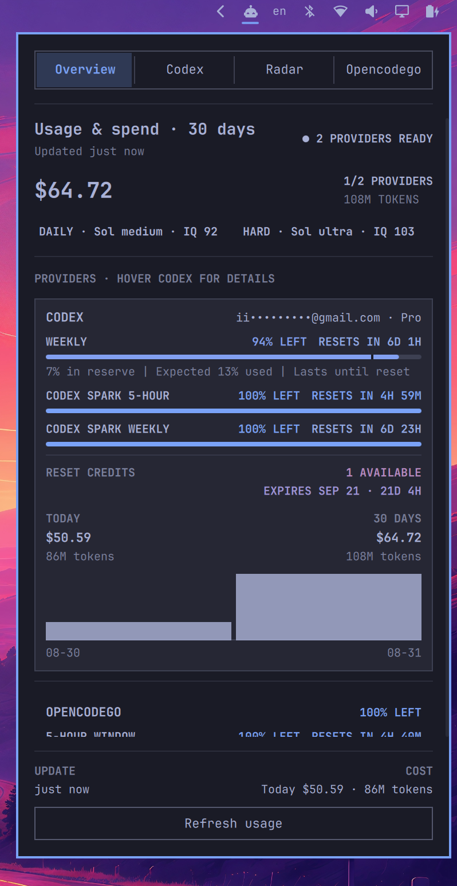
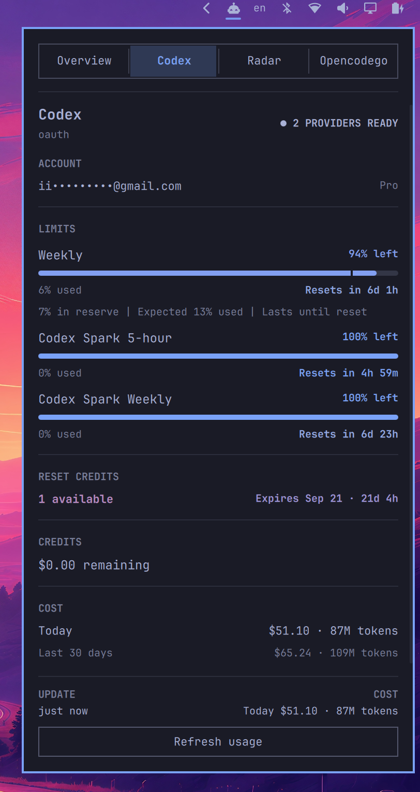

# Omarchy CodexBar

[](LICENSE)
[](https://omarchy.org/)

**English** | [简体中文](README.zh-CN.md)

An open-source system tray plugin for Omarchy. It reads AI provider usage, remaining quotas, reset times, and costs from the local `codexbar serve` API provided by [CodexBar](https://github.com/steipete/CodexBar), and presents [Codex Radar](https://codexradar.com/) model recommendations in a dedicated Radar tab.

## Screenshots

<p align="center">
  <a href="screenshots/overview.png"></a>
  <a href="screenshots/codex-details.png"></a>
  <a href="screenshots/radar.png"></a>
</p>

## Features

- Opens on Overview by default and remembers the last selected tab within the current Shell session.
- Uses the Codex mark in the tray and shows the first (currently most constrained) provider's remaining percentage beside it on horizontal bars.
- Shows only providers returned by `codexbar serve`, ordered as Overview, Codex, Radar, then other providers.
- Shows each provider's most-used model over the last 30 days, ranked by token count when cost breakdown data is available.
- Aggregates 30-day cost and token totals, with compact Daily development and Hard problems recommendations and IQ scores.
- Uses every quota bar to represent **remaining capacity**, including a dynamic expected-remaining marker when provided by the service.
- Changes percentage, reset countdown, reset-credit count, and expiry colors as their live values change.
- Expands the Codex row on hover to show the masked account, plan, quota windows, pace, reset credits, cost, and recent daily history.
- Keeps the tab rail and update controls fixed while the middle content scrolls; supports both mouse and keyboard input.
- Handles service startup, reconnection, errors, empty states, and Radar cache fallback explicitly.
- When the `codexbar` CLI is missing, offers a one-click link to the official installation guide and reconnects automatically after installation.

## Requirements

- [Omarchy](https://omarchy.org/) with plugin support.
- [CodexBar](https://github.com/steipete/CodexBar), with the `codexbar` command available on `PATH`.
- Network access to [Codex Radar](https://codexradar.com/) for model recommendations. The usage panel itself only requires the local CodexBar service.

## Installation

Install [CodexBar CLI](https://aur.archlinux.org/packages/codexbar-cli) from the AUR:

```bash
yay -S codexbar-cli
```

Confirm that `codexbar` is available on `PATH`:

```bash
codexbar --version
```

Then install and enable the plugin:

```bash
omarchy plugin add https://github.com/Choi-Jungwoo/omarchy-codexbar.git --enable --yes
```

The manifest places the plugin in the right section of the Omarchy bar by default. If the Shell still displays an older QML instance after installation, restart it:

```bash
omarchy restart shell
```

Add the default global shortcut to `~/.config/hypr/bindings.lua`:

```lua
o.bind("F12", "CodexBar", "omarchy-shell shell toggle community.codexbar")
```

## Updating

```bash
omarchy plugin update community.codexbar --yes
omarchy restart shell
```

The second command rebuilds the loaded bar widget so the Shell does not retain the previous QML component.

## Usage

- `F12`: open or close the panel globally.
- Click the tray icon: open or close the panel.
- Middle-click the tray icon: refresh the current data.
- `←` / `→` or `H` / `L`: switch tabs.
- `↑` / `↓` or `K` / `J`: move between entries or scroll content.
- `Enter`: open the current provider details or refresh the current detail view.
- `R`: refresh; `O`: return to Overview; `Escape`: close the panel.

## Configuration

Plugin settings are declared in `manifest.json` and can be adjusted through Omarchy's plugin settings:

| Setting | Default | Description |
| --- | ---: | --- |
| `serverPort` | `49273` | Local `codexbar serve` port in the dynamic/private range |
| `refreshIntervalSec` | `60` | Panel refresh interval |
| `radarRefreshIntervalSec` | `300` | Radar recommendation refresh interval |
| `serviceRefreshIntervalSec` | `300` | Provider data refresh interval |
| `requestTimeoutSec` | `8` | Per-request timeout |

## Data Sources and Privacy

- Usage, quota, and cost data come from the local [CodexBar](https://github.com/steipete/CodexBar) service. The plugin reuses a healthy existing service or starts an instance bound only to `127.0.0.1` with `--identity redacted`.
- Model recommendations come from [Codex Radar](https://codexradar.com/). Radar requests are independent from the local CodexBar service and retain the last complete cache on failure.
- The plugin does not duplicate provider authentication logic and does not log tokens, credentials, or complete sensitive payloads.
- Codex Radar data, APIs, and secondary use remain subject to its own terms or authorization requirements. Confirm permission before redistribution or commercial use.

## Local Development

```bash
git clone https://github.com/Choi-Jungwoo/omarchy-codexbar.git
cd omarchy-codexbar

omarchy plugin validate .
node --test tests/model.test.mjs
```

Load the current working tree into Omarchy:

```bash
PLUGIN_DIR="$HOME/.config/omarchy/plugins/community.codexbar"
install -d "$PLUGIN_DIR"
install -m 0644 manifest.json Panel.qml CodexBarService.qml CodexRadarService.qml Model.js "$PLUGIN_DIR/"

omarchy plugin validate "$PLUGIN_DIR"
omarchy-shell shell rescanPlugins
omarchy plugin enable community.codexbar --section right
```

Run `omarchy restart shell` if the UI does not change after a hot reload.

### Project Layout

- `Panel.qml`: tray entry, panel layout, state presentation, and interaction.
- `CodexBarService.qml`: local service lifecycle, health checks, and request coordination.
- `CodexRadarService.qml`: Radar requests, completeness gate, and cache fallback.
- `Model.js`: conversion of CodexBar and Radar responses into stable QML models.
- `tests/model.test.mjs`: model normalization, formatting, and status-scale tests.

## Contributing

Issues and pull requests are welcome. For substantial behavior or protocol changes, please open an issue describing the use case first and preserve these boundaries:

- `codexbar serve` is the single source of truth for usage, status, and actions.
- QML coordinates asynchronous lifecycles, stable model mapping, and UI interaction without duplicating backend business logic.
- Update the README, design documentation, and relevant tests whenever user-visible behavior changes.

## Acknowledgments

- [CodexBar](https://github.com/steipete/CodexBar) provides the local usage, quota, and cost service APIs.
- [Codex Radar](https://codexradar.com/) provides scenario-based model recommendations and efficiency metrics.
- [Omarchy](https://omarchy.org/) provides the desktop environment, Shell, and plugin runtime.

## License

This project is licensed under the [MIT License](LICENSE).
