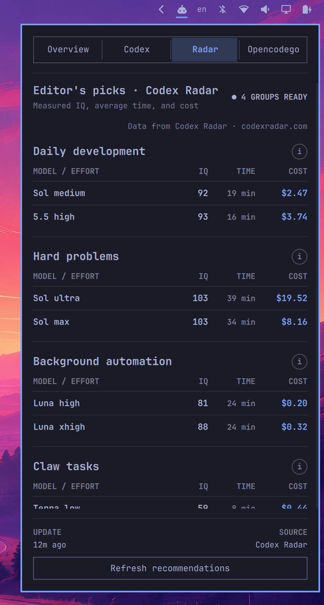

# Omarchy CodexBar

[](LICENSE)
[](https://omarchy.org/)

[English](README.md) | **简体中文**

一个面向 Omarchy 的开源系统托盘插件。它通过 [CodexBar](https://github.com/steipete/CodexBar) 提供的本机 `codexbar serve` 接口展示 AI 提供商用量、剩余额度、重置时间与成本，并在独立 Radar 标签中呈现 [Codex Radar](https://codexradar.com/) 的模型推荐。

## 界面预览

<p align="center">
  <a href="docs/images/overview.png"></a>
  <a href="docs/images/codex-details.png"></a>
  <a href="docs/images/radar.png"></a>
</p>

## 功能

- 默认打开 Overview，并在同一 Shell 会话内记住上次查看的标签。
- 只展示 `codexbar serve` 实际返回的提供商，固定顺序为 Overview、Codex、Radar、其他提供商。
- 汇总最近 30 天成本与 token，并紧凑展示 Daily development 与 Hard problems 的推荐模型及 IQ。
- 所有额度条均表示**剩余比例**，并显示服务提供的动态预计剩余刻度。
- 百分比、重置倒计时、reset credits 次数和截止时间会随实时数值动态变色。
- Codex 行支持悬停展开账号、套餐、全部窗口、pace、reset credits、成本和最近日历史。
- 顶部标签与底部更新操作固定，中间内容独立滚动；支持鼠标和键盘操作。
- 明确处理服务启动、重连、失败、空数据与 Radar 缓存降级状态。

## 要求

- 已安装支持插件系统的 [Omarchy](https://omarchy.org/)。
- 已安装 [CodexBar](https://github.com/steipete/CodexBar)，并确保 `codexbar` 命令位于 `PATH` 中。
- 如需 Radar 推荐，需要能够访问 [Codex Radar](https://codexradar.com/)。用量面板本身只依赖本机 CodexBar 服务。

## 安装

先通过 AUR 安装 [CodexBar CLI](https://aur.archlinux.org/packages/codexbar-cli)：

```bash
yay -S codexbar-cli
```

确认 `codexbar` 已位于 `PATH`：

```bash
codexbar --version
```

然后安装并启用插件：

```bash
omarchy plugin add https://github.com/Choi-Jungwoo/omarchy-codexbar.git --enable --yes
```

插件会按 manifest 的 `defaultSection: right` 出现在 Omarchy 顶栏右侧。若安装后仍显示旧的 QML 实例，重启 Shell：

```bash
omarchy restart shell
```

## 更新

```bash
omarchy plugin update community.codexbar --yes
omarchy restart shell
```

第二条命令会重建已加载的 bar-widget，避免 Shell 继续保留更新前的 QML 组件。

## 使用

- 点击托盘图标：打开或关闭面板。
- 中键点击托盘图标：刷新当前数据。
- `←` / `→` 或 `H` / `L`：切换标签。
- `↑` / `↓` 或 `K` / `J`：移动条目或滚动内容。
- `Enter`：打开当前提供商详情或刷新当前详情。
- `R`：刷新；`O`：返回 Overview；`Escape`：关闭面板。

## 配置

插件配置由 `manifest.json` 声明，可通过 Omarchy 的插件设置调整：

| 配置项 | 默认值 | 说明 |
| --- | ---: | --- |
| `serverPort` | `49273` | `codexbar serve` 本机端口（动态/私有端口段） |
| `refreshIntervalSec` | `60` | 面板刷新间隔 |
| `radarRefreshIntervalSec` | `300` | Radar 推荐刷新间隔 |
| `serviceRefreshIntervalSec` | `300` | 提供商数据刷新间隔 |
| `requestTimeoutSec` | `8` | 单次请求超时 |

## 数据来源与隐私

- 用量、额度和成本来自本机 [CodexBar](https://github.com/steipete/CodexBar) 服务。插件优先复用已有服务；若服务不存在，则启动仅监听 `127.0.0.1` 且使用 `--identity redacted` 的实例。
- 模型推荐来自 [Codex Radar](https://codexradar.com/)。Radar 请求与本机 CodexBar 服务相互独立，失败时会保留最后一次完整缓存。
- 插件不会复制提供商鉴权逻辑，也不会在日志中输出令牌、凭据或完整敏感响应。
- Codex Radar 的数据、API 和二次使用受其自身条款或授权要求约束；请在分发或商业使用前自行确认许可。

## 本地开发

```bash
git clone https://github.com/Choi-Jungwoo/omarchy-codexbar.git
cd omarchy-codexbar

omarchy plugin validate .
node --test tests/model.test.mjs
```

将当前工作区加载到 Omarchy：

```bash
PLUGIN_DIR="$HOME/.config/omarchy/plugins/community.codexbar"
install -d "$PLUGIN_DIR"
install -m 0644 manifest.json Panel.qml CodexBarService.qml CodexRadarService.qml Model.js "$PLUGIN_DIR/"

omarchy plugin validate "$PLUGIN_DIR"
omarchy-shell shell rescanPlugins
omarchy plugin enable community.codexbar --section right
```

若热重载后界面没有变化，执行 `omarchy restart shell`。

### 项目结构

- `Panel.qml`：托盘入口、面板布局、状态呈现与交互。
- `CodexBarService.qml`：本机服务生命周期、健康检查与请求协调。
- `CodexRadarService.qml`：Radar 请求、完整性门槛与缓存降级。
- `Model.js`：CodexBar/Radar 响应到稳定 QML 模型的转换。
- `tests/model.test.mjs`：模型规范化、格式化与状态刻度测试。

## 贡献

欢迎提交 Issue 和 Pull Request。较大的行为或协议改动建议先开 Issue 说明使用场景，并保持以下边界：

- `codexbar serve` 是用量、状态和操作能力的唯一事实来源。
- QML 负责异步生命周期协调、稳定模型映射和界面交互，不复制后端业务逻辑。
- 新增用户可见行为时同步更新 README、设计说明与相关测试。

## 致谢

- [CodexBar](https://github.com/steipete/CodexBar)：提供本机用量、额度与成本服务接口。
- [Codex Radar](https://codexradar.com/)：提供场景化模型推荐与效率指标。
- [Omarchy](https://omarchy.org/)：提供桌面环境、Shell 与插件运行时。

## 许可证

本项目采用 [MIT License](LICENSE)。
